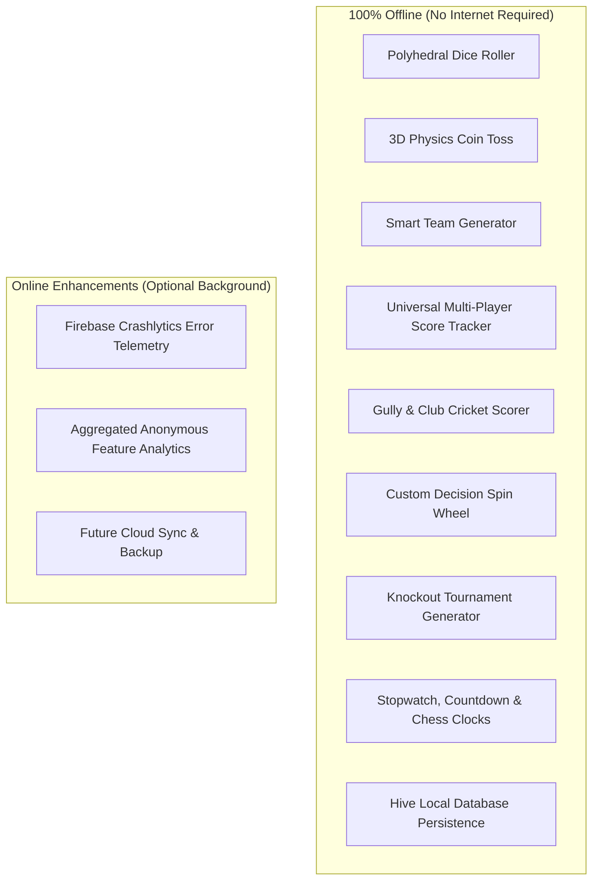

# Application Information & Technical Specifications

This document defines the authoritative system configuration, software platform parameters, version history, and device compatibility matrix for **PlayMate**.

---

## 📱 Core Application Specifications

| Parameter | Specification | Details |
| :--- | :--- | :--- |
| **Application Name** | **PlayMate** | Official brand identity |
| **Tagline** | *Everything you need for offline games.* | Global product marketing tagline |
| **Android Application ID** | `com.sundramdotdev.playmate` | Package namespace registered in Gradle |
| **iOS Bundle Identifier** | `com.sundramdotdev.playmate` | App bundle ID configured in Xcode |
| **Minimum Android Version** | **Android 6.0 (API Level 23)** | Covers $>99.5\%$ of active global Android devices |
| **Target Android Version** | **Android 14 / 15 (API Level 34/35)**| Complies with Google Play API target requirements |
| **Minimum iOS Version** | **iOS 14.0** | Compatible with iPhone 6s through current iPhone generation |
| **Flutter SDK Version** | `^3.24.0` | Built with stable channel Flutter framework |
| **Dart SDK Version** | `^3.5.0 < 4.0.0` | Sound null safety enforced |
| **Primary Architecture** | Clean Architecture + Feature First | Modular, testable decoupled components |
| **State Management** | Flutter Riverpod 2.6 | Compile-safe state notifications |
| **Local Persistence** | Hive 2.2 / Hive Flutter 1.1 | Sub-millisecond binary key-value database |

---

## 🌍 Localization & Supported Languages

PlayMate is architected with complete `intl` string abstraction, supporting:
- **English (en-US / en-GB):** Primary default locale.
- **Hindi (hi-IN):** Full interface translation (especially popular for Cricket scoring and gully games).
- **Spanish (es-ES / es-MX):** Board game & family utility support.
- **German (de-DE):** Euro-game and board gaming terminology support.

---

## 📱 Hardware & Device Compatibility

| Form Factor | Minimum Spec | Experience Mode |
| :--- | :--- | :--- |
| **Compact Smartphones** | 4.7" display (e.g. iPhone SE) | 2-column scrollable grid with compact card aspect ratio |
| **Standard Smartphones** | 6.1" – 6.7" (Pixel 8, iPhone 15/16) | Standard 2-column grid, full edge-to-edge layout |
| **Foldables & Dual-Screen**| Galaxy Z Fold / Pixel Fold | Dynamic multi-column responsive grid via `ResponsiveLayout` |
| **Tablets** | iPad, iPad Mini, Galaxy Tab | 3-to-4 column grid, expanded split scoreboard views |

---

## 🔒 Permissions Policy

PlayMate respects user privacy and adheres to a minimal permission philosophy:

| Permission | Platform | Mandatory? | Rationale |
| :--- | :--- | :---: | :--- |
| **VIBRATE** | Android | No | Provides subtle tactile haptic feedback on dice rolls and coin flips. |
| **HIGH_SAMPLING_RATE_SENSORS** | Android | No | Smooth accelerometer readings for shake-to-roll physics. |
| **INTERNET** | Android / iOS | No | Only utilized for optional Firebase crash reports. Bypassed offline. |

> [!NOTE]
> PlayMate **never** requests Camera, Microphone, GPS Location, Contacts, or Storage write permissions to external media.

---

## 🔌 Offline vs. Online Capabilities

---

## 🎨 Theme & Accessibility Support

- **Supported Themes:** Material 3 Adaptive Light Mode, Pure OLED Charcoal Dark Mode, and System Theme Matcher.
- **Accessibility:** Screen reader semantics tags, WCAG 2.1 AAA contrast compliance, dynamic font scaling support up to 200%, and tactile haptic redundancy for all audio cues.

---

## 📜 Complete Version History

### Version 1.0.0 (Public Production Release)
- **Release Date:** October 1, 2026
- **Features:** Complete launch suite of 8 offline gaming tools (Dice, Coin, Teams, Scores, Cricket, Wheel, Tournaments, Timers).
- **Improvements:** 120Hz smooth animations, OLED dark mode, Hive local persistence, GoRouter deep linking.
- **Breaking Changes:** None (initial stable public release).

### Version 0.9.0 (Release Candidate - RC1)
- **Release Date:** September 20, 2026
- **Features:** Finished Tournament Bracket visualizer, Chess clock increment controls.
- **Fixes:** Fixed audio stutter on low-end devices, resolved memory leaks on accelerometer subscriptions.

### Version 0.5.0 (Beta Milestone)
- **Release Date:** August 15, 2026
- **Features:** Introduced Cricket Scorer module, Hive persistence service, and haptic feedback.
- **Refactoring:** Replaced `setState` with Riverpod `StateNotifier`.

### Version 0.1.0 (Initial Prototype)
- **Release Date:** April 5, 2026
- **Features:** Basic single-die roller and coin flip prototype. Proof of concept for accelerometer shake gestures.
