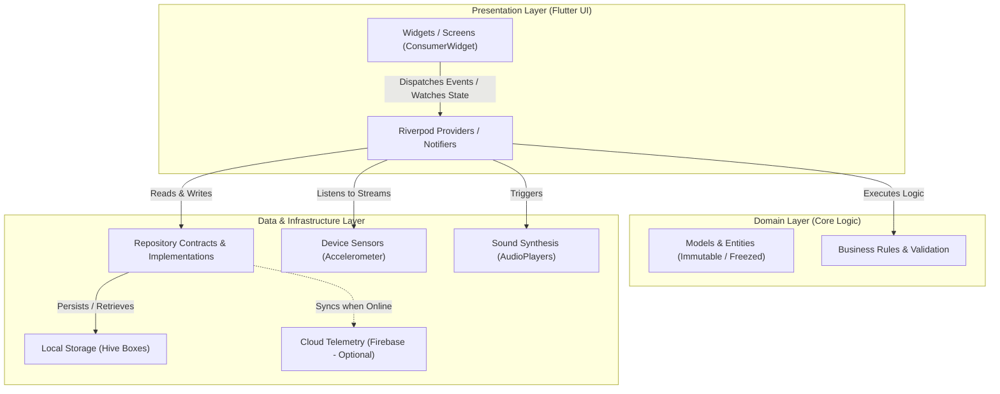

# PlayMate System Architecture

This document specifies the technical and architectural foundations of the **PlayMate** application. The system is designed to provide maximum maintainability, testability, offline reliability, and low cognitive overhead for contributors.

---

## 🏛️ Architectural Principles

PlayMate combines **Clean Architecture** with a **Feature-First** modular organization:

1. **Separation of Concerns:** Business logic is strictly isolated from presentation widgets and platform-level infrastructure.
2. **Feature-First Modularity:** All code related to a distinct domain utility (e.g., `dice`, `cricket`, `timer`) is co-located inside its own feature folder rather than segregated by architectural layer.
3. **Unidirectional Data Flow:** State mutations flow in a single direction from user actions through Riverpod Notifiers down to persistent storage.
4. **Offline-First by Design:** The presentation layer interacts solely with local storage repositories. Remote synchronization operates in the background without blocking the UI.

---

## 📐 High-Level Architectural Layers



---

## 📁 Feature-First Directory Structure

Every feature under `lib/features/` encapsulates its own presentation, domain logic, and state. Common services and cross-cutting components live in `lib/core/`, `lib/services/`, and `lib/shared/`:

```text
lib/
├── core/                        # Global foundational definitions
│   ├── constants.dart           # App-wide fixed dimensions & strings
│   └── theme.dart               # Theme tokens, Light & Dark ColorSchemes
├── features/                    # Feature modules
│   ├── coin/                    # Coin Toss module
│   │   ├── coin_provider.dart   # CoinNotifier & state providers
│   │   └── coin_screen.dart     # 3D interactive flip screen
│   ├── cricket/                 # Gully & Club Cricket scorer
│   │   ├── cricket_provider.dart# Ball-by-ball match logic
│   │   └── cricket_screen.dart  # Scoreboard and control keypad
│   ├── dice/                    # Polyhedral dice roller
│   │   ├── dice_provider.dart   # Roll calculation & shake listener
│   │   ├── dice_screen.dart     # Graphical dice rendering
│   │   └── dice_state.dart      # Immutable dice state model
│   ├── home/                    # Launcher dashboard
│   │   └── home_screen.dart     # Responsive grid of utility tools
│   ├── score_tracker/           # Multi-player score keeper
│   │   ├── score_provider.dart  # Scoreboard state notifier
│   │   └── score_screen.dart    # Player ledger and round history
│   ├── settings/                # User preferences & data reset
│   │   └── settings_screen.dart # Theme, audio, and storage controls
│   ├── spin_wheel/              # Custom decision wheel
│   │   ├── spin_wheel_provider.dart # Spin physics calculations
│   │   └── spin_wheel_screen.dart   # Canvas-based wheel drawing
│   ├── team_generator/          # Squad partitioning utility
│   │   ├── team_provider.dart   # Partitioning algorithms
│   │   └── team_screen.dart     # Roster builder and output cards
│   ├── timer/                   # Multi-mode timing clocks
│   │   ├── timer_provider.dart  # Ticker streams & countdown logic
│   │   ├── timer_screen.dart    # Stopwatch, countdown & chess clocks
│   │   └── timer_state.dart     # Clock state representations
│   └── tournament/              # Knockout bracket builder
│       ├── tournament_provider.dart # Bracket tree advancement logic
│       └── tournament_screen.dart   # Interactive bracket view
├── routes/                      # Routing declaration
│   └── router.dart              # GoRouter instance & route definitions
├── services/                    # Shared infrastructure layer
│   ├── firebase_service.dart    # Telemetry and crash reporting bridge
│   ├── sound_service.dart       # Sound FX playback wrapper
│   └── storage_service.dart     # Hive database initialization & access
├── shared/                      # Reusable UI widgets
│   └── responsive_layout.dart   # Adaptive breakpoints (Mobile/Tablet)
└── main.dart                    # Application bootstrap entry point
```

---

## ⚡ State Management: Riverpod 2.x

PlayMate utilizes **Flutter Riverpod** as its central dependency injection and reactive state management framework.

### Why Riverpod?
- **Compile-Time Safety:** Eliminates `ProviderNotFoundException`.
- **Global Declaration, Scoped Lifecycle:** Providers are declared as top-level constants and can be disposed of automatically or cached.
- **Easy Testing & Mocking:** Providers can be selectively overridden in widget and unit test scopes via `ProviderScope(overrides: [...])`.

### State Flow Pattern

```text
[User Interaction] 
       │ (Taps "Roll Dice" or Shakes Device)
       ▼
[Widget: ConsumerWidget]
       │ ref.read(diceProvider.notifier).rollDice()
       ▼
[Notifier: DiceNotifier]
       │ Computes crypto-random dice values
       │ Plays sound via SoundService
       │ Logs event via AnalyticsService
       │ Emits new immutable DiceState
       ▼
[Widget Re-render]
       │ ref.watch(diceProvider) detects state change
       ▼
[UI Updates Smoothly]
```

### Typical Provider Implementation Example

```dart
// Immutable State Model
class DiceState {
  final List<int> values;
  final int total;
  final bool isRolling;

  const DiceState({
    required this.values,
    required this.total,
    this.isRolling = false,
  });

  DiceState copyWith({List<int>? values, int? total, bool? isRolling}) {
    return DiceState(
      values: values ?? this.values,
      total: total ?? this.total,
      isRolling: isRolling ?? this.isRolling,
    );
  }
}

// StateNotifier Provider
final diceProvider = StateNotifierProvider<DiceNotifier, DiceState>((ref) {
  return DiceNotifier();
});
```

---

## 🧭 Navigation & Deep Linking: GoRouter

Application routing is driven by **GoRouter 17.3**, offering declarative, URL-based navigation:

### Route Definitions (`lib/routes/router.dart`)
```dart
final GoRouter appRouter = GoRouter(
  initialLocation: '/',
  routes: [
    GoRoute(path: '/', builder: (context, state) => const HomeScreen()),
    GoRoute(path: '/dice', builder: (context, state) => const DiceScreen()),
    GoRoute(path: '/coin', builder: (context, state) => const CoinScreen()),
    GoRoute(path: '/teams', builder: (context, state) => const TeamGeneratorScreen()),
    GoRoute(path: '/scores', builder: (context, state) => const ScoreTrackerScreen()),
    GoRoute(path: '/cricket', builder: (context, state) => const CricketScreen()),
    GoRoute(path: '/spin', builder: (context, state) => const SpinWheelScreen()),
    GoRoute(path: '/tournament', builder: (context, state) => const TournamentScreen()),
    GoRoute(path: '/timers', builder: (context, state) => const TimerScreen()),
    GoRoute(path: '/settings', builder: (context, state) => const SettingsScreen()),
  ],
);
```

### Advantages of Declarative Routing
- Seamless browser URL mapping for Flutter Web / Desktop expansion.
- Full deep-linking capability on Android and iOS (e.g., launching directly into a match via custom scheme `playmate://tournament?id=123`).
- Clean separation of UI navigation intents from UI widget rendering.

---

## 💾 Data Persistence: Hive Database

For offline reliability, PlayMate uses **Hive**:
- **Pure Dart & Zero Native Overhead:** Hive is written entirely in Dart, avoiding complex SQLite bridge overhead.
- **Sub-Millisecond Read Times:** Key-value pairs and binary indexed boxes reside in memory while syncing asynchronously to disk.
- **Dedicated Boxes:** Distinct boxes are opened on startup (`settings`, `matches`, `achievements`, `statistics`) to keep data access compartmentalized.

For detailed schemas and migration patterns, refer to [HIVE_DATABASE.md](./HIVE_DATABASE.md).

---

## 🛡️ Error Handling & Resiliency

1. **Graceful Sensor Degradation:** If device accelerometer hardware is unavailable or permissions are denied, shake-to-roll silently disables itself and prompts the user with standard on-screen tap controls.
2. **Crashlytics Logging:** Unhandled exceptions caught by Flutter's error handlers are caught at the root:
   ```dart
   FlutterError.onError = FirebaseCrashlytics.instance.recordFlutterFatalError;
   PlatformDispatcher.instance.onError = (error, stack) {
     FirebaseCrashlytics.instance.recordError(error, stack, fatal: true);
     return true;
   };
   ```
3. **Safe Storage Defaults:** Hive queries always provide safe fallback values (e.g., `defaultValue: false`) preventing null crashes if local records are corrupted.
