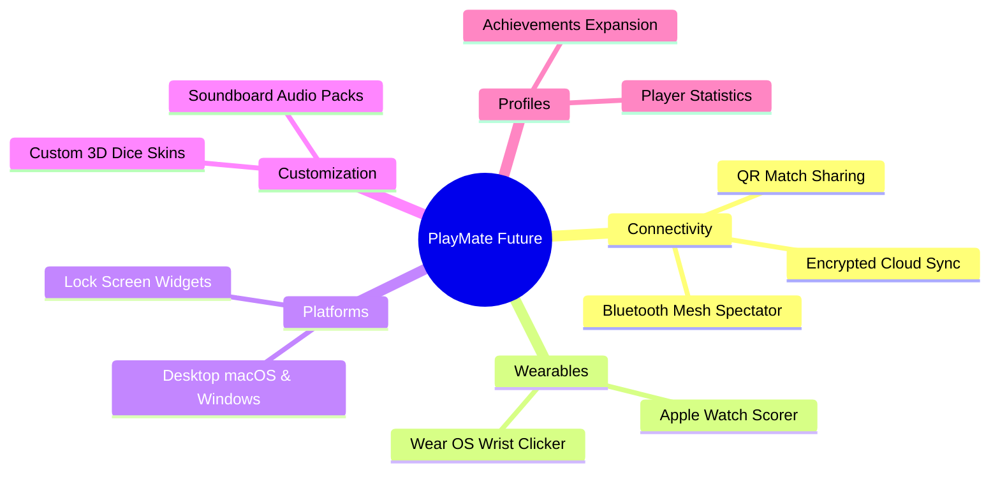

# Future Features & Product Specifications

This document outlines the detailed architectural blueprints and functional specifications for planned expansions to **PlayMate**.

---

## 🚀 Upcoming Roadmap Features

---

## 1. 📱 QR Code Match Joining & Sharing
- **Concept:** Offline peer sharing via high-density visual QR codes.
- **Workflow:**
  1. The match scorer finishes or pauses a cricket match, tournament bracket, or team roster.
  2. The app compresses the game state payload using zlib/gzip and generates an animated or static QR code on screen.
  3. Other players scan the QR code with their PlayMate app to instantly import the exact match record into their local Hive storage—zero internet required.

---

## 2. ☁️ Encrypted Cloud Sync & Personal Backups
- **Concept:** Multi-device synchronization for players who use multiple devices (e.g. tablet at home, phone on the field).
- **Security:** End-to-end encryption using user-derived passphrase. Data stored in Cloud Firestore is unreadable to server operators.
- **Conflict Resolution:** Last-Write-Wins (LWW) with automated match merge detection.

---

## 3. 👤 Permanent Player Profiles & Head-to-Head Records
- **Concept:** Track lifelong records across multiple game nights.
- **Features:**
  - Create permanent player cards with customizable avatars, nicknames, and favorite games.
  - Automatic calculation of Win/Loss percentages, ELO ratings for 1v1 games, and total points scored.
  - Head-to-Head comparison cards (e.g., "Alice vs. Bob: 14 matches played, 8 wins Alice, 6 wins Bob").

---

## 4. 🏆 Achievements & Gamification Expansion
- **Concept:** Delightful offline Easter eggs that reward consistent play.
- **Milestones:**
  - *Snake Eyes:* Roll two 1s on double D6 dice.
  - *Century Scorer:* Score 100+ runs in a single cricket match scorecard.
  - *Master Tactician:* Complete a 16-player tournament bracket.
  - *Grandmaster:* Run a 60-minute chess clock session without timeouts.

---

## 5. ⌚ Wear OS & Apple Watch Companion Apps
- **Concept:** Score games directly from your wrist without retrieving your phone.
- **Wearable Controls:**
  - **Cricket Wrist Clicker:** Tap top half for single run, swipe for 4/6, bottom button for wickets.
  - **Wrist Dice & Coin:** Shake your wrist to roll a die or flip a coin with independent Taptic vibration.
  - **Turn Buzzer:** Gentle vibrating pulse on the wrist when your turn timer is down to 5 seconds.

---

## 6. 🧩 Home Screen & Lock Screen Quick Widgets
- **iOS WidgetKit & Android App Widgets:**
  - **Instant Coin Toss Widget:** Tap the widget directly from the home screen for an instant result without launching the full app.
  - **Active Timer Widget:** Live countdown and stopwatch tracking on the iOS Dynamic Island and Android Lock Screen.

---

## 7. 💻 Desktop & Large Screen TV Presentation Mode
- **Target OS:** macOS, Windows, iPadOS, and Android TV.
- **Scenario:** Community game centers and pub trivia nights.
- **Features:**
  - Fullscreen scoreboard mode with large-format typography visible from across the room.
  - Keyboard shortcuts (Space to roll dice, C to flip coin, Arrow keys to adjust scores).
  - External monitor display support while keeping controls on the primary phone screen.
