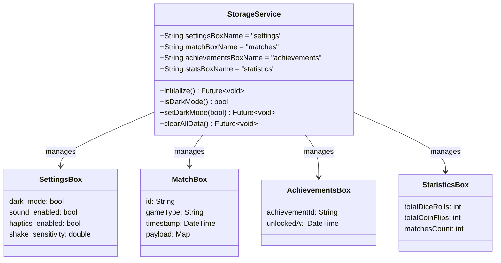

# Hive Database Architecture & Schema Guide

This document describes the offline-first local persistence layer powering **PlayMate**, implemented using **Hive 2.2** and **Hive Flutter 1.1**.

---

## ⚡ Why Hive for PlayMate?

For an offline game utility app, traditional SQLite databases introduce undesirable overhead:
1. **Zero Native Bridge Serialization:** Hive is written 100% in pure Dart. It avoids passing serialized data over the native platform channel.
2. **Instant Startup & Sub-Millisecond Reads:** Hive stores records in binary format and loads indexed keys directly into memory, enabling synchronous reads with zero frame drops ($< 1\text{ms}$).
3. **No Heavy SQL Boilerplate:** Simple, type-safe object storage via TypeAdapters.

---

## 📦 Hive Boxes & Data Schemas

The application initializes 4 dedicated Hive boxes on application bootstrap in `StorageService.initialize()`:



### Box Directory & Specifications

| Box Name | Storage Type | Purpose | Encryption |
| :--- | :--- | :--- | :---: |
| `settings` | Key-Value (`Box<dynamic>`) | UI preferences, audio toggles, haptics, theme mode | None |
| `matches` | Typed Collection (`Box<MatchRecord>`) | Complete historical matches (cricket scorecards, tournaments, scoreboards) | Optional |
| `achievements` | Key-Value (`Box<DateTime>`) | Unlocked Easter eggs, high scores, milestones | None |
| `statistics` | Key-Value (`Box<int>`) | Aggregate counters (total rolls, coin flips, time spent) | None |

---

## 🏗️ Models & TypeAdapters

Custom models are serialized into compact binary streams using Hive TypeAdapters generated by `hive_generator`.

### Example: Match Record Model (`lib/features/cricket/match_model.dart`)

```dart
import 'package:hive/hive.dart';

part 'match_model.g.dart';

@HiveType(typeId: 1)
class MatchRecord extends HiveObject {
  @HiveField(0)
  final String id;

  @HiveField(1)
  final String gameType; // 'cricket', 'score_tracker', 'tournament'

  @HiveField(2)
  final DateTime createdAt;

  @HiveField(3)
  final String title;

  @HiveField(4)
  final Map<String, dynamic> matchData;

  MatchRecord({
    required this.id,
    required this.gameType,
    required this.createdAt,
    required this.title,
    required this.matchData,
  });
}
```

### Adapter Registration
All adapters are registered before opening boxes during application startup in `main.dart`:

```dart
void registerHiveAdapters() {
  if (!Hive.isAdapterRegistered(1)) {
    Hive.registerAdapter(MatchRecordAdapter());
  }
}
```

---

## 🔄 Schema Migration Strategy

Because PlayMate is completely offline, breaking changes to Hive schemas must never cause app crashes or silent data loss. We adhere to **Strict Non-Destructive Schema Evolution**:

### Rule 1: Never Change Existing HiveField Indices
Never alter `@HiveField(0)` to point to a different property. If a field is deprecated:
- Leave the `@HiveField(N)` annotation intact.
- Mark the Dart property with `@deprecated`.

### Rule 2: Always Provide Defaults for New Fields
When adding new fields in minor updates:
```dart
@HiveType(typeId: 1)
class MatchRecord extends HiveObject {
  @HiveField(0)
  final String id;

  // Added in v1.1.0: nullable or with default value
  @HiveField(5)
  final String? venueName;
}
```
Hive will safely decode existing database records by setting unpopulated fields to `null`.

### Rule 3: Versioned Box Migration Script
If a major model rewrite occurs:
1. Bump box name version (e.g., from `matches_v1` to `matches_v2`).
2. Run a one-time migration routine on startup:
```dart
Future<void> migrateMatchesIfNeeded() async {
  final oldBox = await Hive.openBox('matches_v1');
  final newBox = await Hive.openBox<MatchRecord>('matches_v2');

  if (oldBox.isNotEmpty && newBox.isEmpty) {
    for (final key in oldBox.keys) {
      final oldData = oldBox.get(key) as Map;
      // Convert legacy map to new strongly-typed model
      final record = MatchRecord.fromLegacy(oldData);
      await newBox.put(key, record);
    }
    await oldBox.clear();
  }
}
```

---

## 🧹 Data Management & Factory Reset

Users retain 100% control over their local data. In accordance with privacy best practices, `StorageService.clearAllData()` allows users to wipe their match history and statistics in one tap from the Settings screen:

```dart
static Future<void> clearAllData() async {
  await getMatchBox().clear();
  await getAchievementsBox().clear();
  await getStatsBox().clear();
}
```
Settings (theme, sound preferences) remain intact to maintain user comfort after a data reset.
