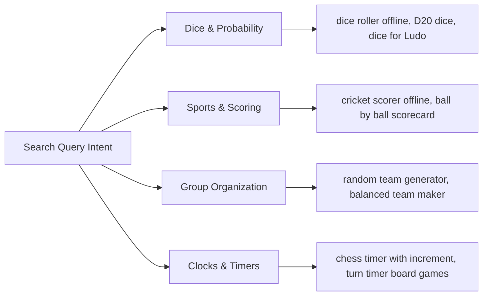

# Search Engine Optimization (SEO) & Web Discovery Strategy

This document establishes the strategic search engine optimization (SEO) architecture and web discovery framework for **PlayMate**.

---

## 🧭 Brand Positioning & Search Intent

### Brand Identity
**PlayMate** is positioned as an **Offline Game Companion & Utility Toolkit**. It is not a mobile video game; rather, it is the digital utility kit used by players while participating in physical, real-world games (board games, sports, tabletop RPGs, card games, and party activities).

### Primary Search Intents Addressed:
1. **Utility Problem-Solving:** Users who lost a physical die, lack a coin, or need a scorecard right now.
2. **Organization & Fair Play:** Users organizing pickup teams, managing cricket overs, or structuring tournament brackets.
3. **Ad-Free Offline Privacy:** Gamers seeking reliable tools that work in remote cabins, parks, or planes without pop-up ads.

---

## 🕸️ Keyword Clusters & Search Intent Mapping



---

## 🌐 Recommended Landing Page Architecture

For the official web presence (`https://playmateapp.com`), the recommended URL structure maps directly to individual high-intent search queries:

| Route | Primary Keyword Target | Target Content & Call to Action |
| :--- | :--- | :--- |
| `/` | `offline game helper, gaming utilities` | Product overview, tool catalog, App Store & Google Play download badges. |
| `/dice-roller` | `virtual dice, online dice roller, D20 roller` | Interactive web dice sandbox, polyhedral D4-D20 explanation, download prompt. |
| `/coin-toss` | `flip a coin, coin toss online, heads or tails` | Interactive 3D coin toss demo, physics explanation, download badge. |
| `/team-generator`| `random team generator, team maker by skill` | Fast web squad divider, explanation of balanced algorithms, mobile app link. |
| `/cricket-scorer`| `gully cricket scorer, offline cricket app` | Cricket scoring rules, over counters, mobile feature highlights. |
| `/score-tracker` | `scoreboard app, multi player scorekeeper` | Multi-round ledger benefits, undo mechanism, download button. |
| `/tournament-generator` | `knockout bracket maker, tournament generator` | Single and double elimination bracket preview, mobile download badge. |
| `/game-timer` | `chess clock online, board game turn timer` | Dual timer with Fischer increments, audio cues, mobile download link. |
| `/offline-game-helper` | `offline game tools, party game utilities` | Pillar guide explaining how PlayMate enhances game nights. |

---

## 🏷️ Metadata & Structured Data Standards

### HTML Header Specifications
```html
<title>PlayMate — Everything You Need for Offline Games</title>
<meta name="description" content="All-in-one offline companion for board games, sports, and game nights. Polyhedral dice, 3D coin toss, team generator, cricket scorer, tournament brackets & timers. 100% ad-free.">
<meta name="keywords" content="offline game helper, dice roller, coin toss, team generator, cricket scorer, score tracker, chess timer, tournament generator">
<link rel="canonical" href="https://playmateapp.com/" />

<!-- Open Graph / Facebook -->
<meta property="og:type" content="website" />
<meta property="og:url" content="https://playmateapp.com/" />
<meta property="og:title" content="PlayMate — Everything You Need for Offline Games" />
<meta property="og:description" content="Your all-in-one offline companion for board games, sports, and casual games. Free & ad-free." />
<meta property="og:image" content="https://playmateapp.com/assets/og-preview.png" />

<!-- Twitter / X -->
<meta name="twitter:card" content="summary_large_image" />
<meta name="twitter:title" content="PlayMate — Offline Game Tools" />
<meta name="twitter:description" content="Everything you need for offline games: dice, coin toss, teams, cricket score, and timers." />
<meta name="twitter:image" content="https://playmateapp.com/assets/og-preview.png" />
```

### Schema.org Structured Data (`SoftwareApplication`)
```json
{
  "@context": "https://schema.org",
  "@type": "SoftwareApplication",
  "name": "PlayMate",
  "operatingSystem": "Android, iOS",
  "applicationCategory": "UtilitiesApplication",
  "description": "Offline game companion featuring polyhedral dice, 3D coin flip, team generator, cricket scorer, scoreboard, and game clocks.",
  "offers": {
    "@type": "Offer",
    "price": "0",
    "priceCurrency": "USD"
  },
  "author": {
    "@type": "Person",
    "name": "Sundramdotdev",
    "url": "https://github.com/sundramdotdev"
  }
}
```

---

## ❓ FAQ SEO

The following high-intent questions should be marked up with `FAQPage` schema on the public site and app documentation:

### Q: What is PlayMate?
**A:** PlayMate is an all-in-one offline gaming companion that equips players, referees, and organizers with essential tools (dice roller, coin toss, team generator, cricket scorer, scorekeeper, spin wheel, tournament brackets, and timers) for physical and tabletop games.

### Q: Is PlayMate free?
**A:** Yes, PlayMate is completely free and 100% ad-free with zero pop-ups or paywalls.

### Q: Does PlayMate work offline?
**A:** Yes. PlayMate is designed offline-first. Every core tool operates without Wi-Fi, cellular reception, or mobile data.

### Q: Does PlayMate need an internet connection?
**A:** No. An internet connection is never required to roll dice, flip coins, generate teams, score cricket matches, or run timers.

### Q: Can I use PlayMate for Ludo?
**A:** Yes. The Dice Roller provides a responsive six-sided (D6) die with realistic roll animations and physical shake-to-roll detection perfect for Ludo, Snakes & Ladders, and Monopoly.

### Q: Does PlayMate have a dice roller?
**A:** Yes. It includes both standard D6 dice and polyhedral RPG dice (D4, D6, D8, D10, D12, D20) with simultaneous rolling of 1 to 6 dice.

### Q: Can I toss a coin digitally?
**A:** Yes. The Coin Toss utility provides a physics-based 3D flip with a fair 50/50 probability, multi-coin support, and tactile haptic feedback.

### Q: Can PlayMate generate random teams?
**A:** Yes. You can input or paste player rosters and automatically split them into 2 to 8 teams using either Pure Random or Skill-Weighted balancing modes.

### Q: Can I track cricket scores?
**A:** Yes. The built-in Cricket Scorer provides ball-by-ball scoring for gully and club cricket, tracking legal balls, overs, wickets, extras (wides/no-balls), and run rates.

### Q: Can I create tournaments?
**A:** Yes. The Tournament Generator builds automated single and double elimination brackets for 4 to 32 players or teams with interactive winner progression.

### Q: Does PlayMate store my match history?
**A:** Yes. Match records and game histories are saved locally on your device using Hive database storage with zero latency.

### Q: Does PlayMate collect personal information?
**A:** No. PlayMate does not require user accounts and collects zero personally identifiable information (no names, emails, phone numbers, or GPS location).
